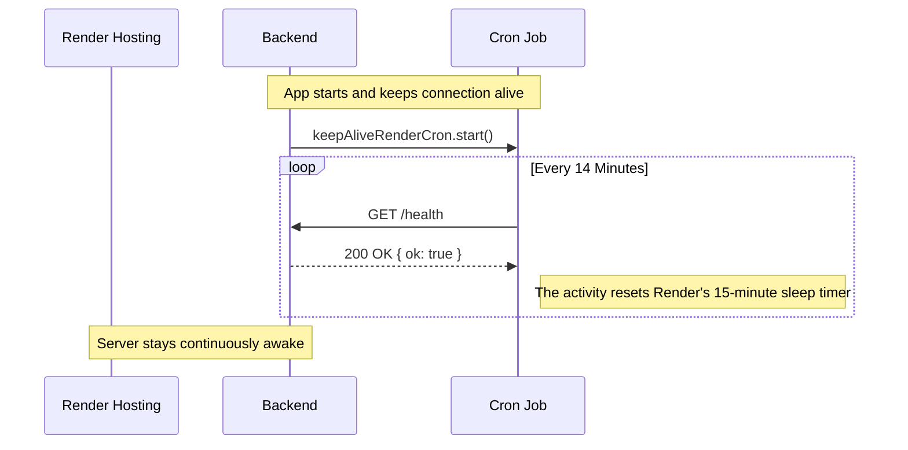

# Keep-Alive Cron Job

This document explains the purpose and flow of the Keep-Alive Cron Job configured in our backend.

## Why do we need this?

We are hosting our backend on a platform (like Render's free tier) that puts instances to sleep after a period of inactivity (typically 15 minutes). When the instance goes to sleep, the next incoming request takes significantly longer to process because the server has to "wake up" (cold start).

To prevent this, we run a scheduled background task (cron job) that automatically sends a request to our own backend every 14 minutes, ensuring the server stays awake and responsive.

## Flow Diagram

Below is a diagram illustrating how the Keep-Alive Cron Job works within our server architecture:

## Implementation Details

1. **`cron.js`**: We define a new job using the `cron` package. The expression `*/14 * * * *` means it will trigger exactly on the 14th minute of the hour, 28th, 42nd, and so on. It sends a simple HTTP GET request to our `/health` endpoint.
2. **`server.js`**: When our Express server is successfully bound to the port and starts listening (in production environments), we invoke `.start()` on our cron job. This activates the 14-minute timer.

> [!NOTE]
> The cron job does **not** trigger instantly upon calling `start()`. It waits for the next clock match (e.g. if you start it at 12:05, the first ping happens at 12:14).
